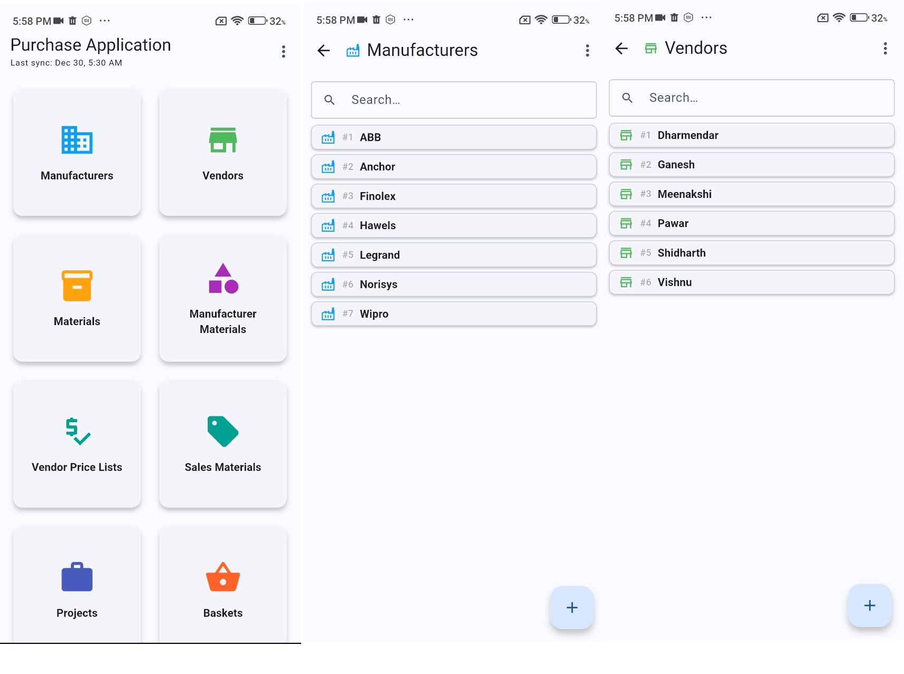
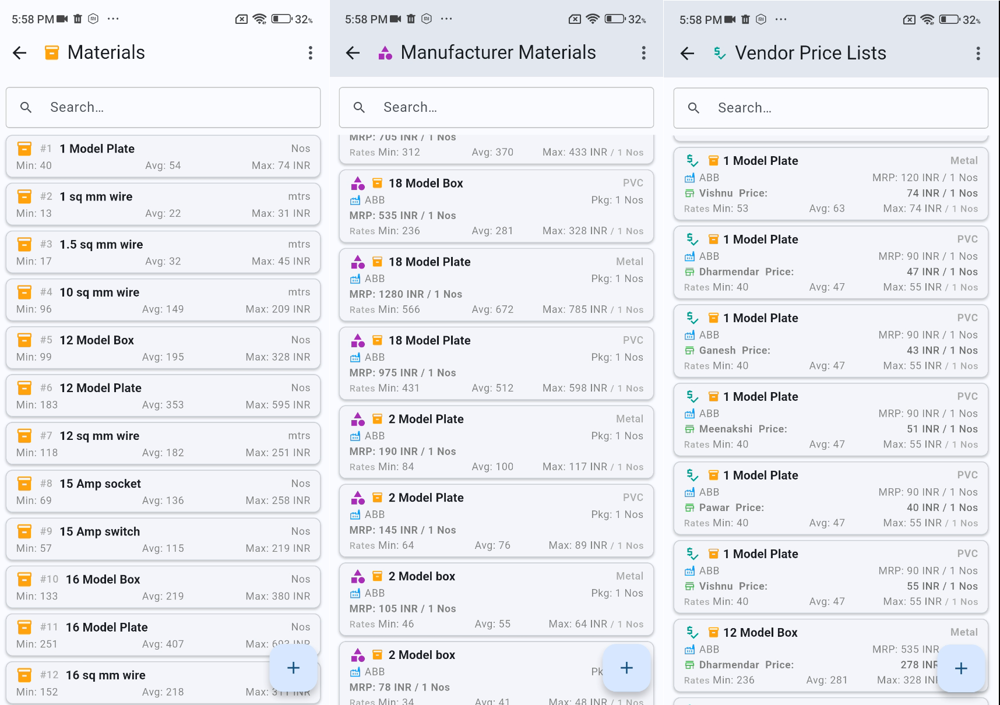
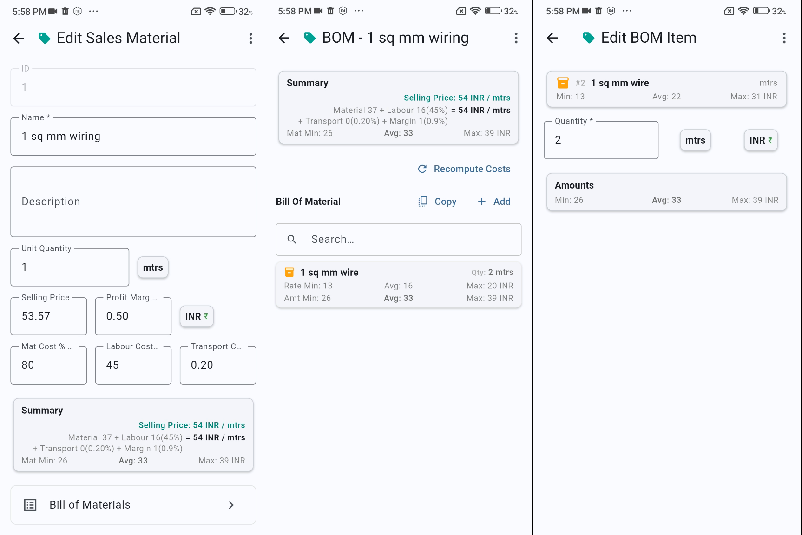
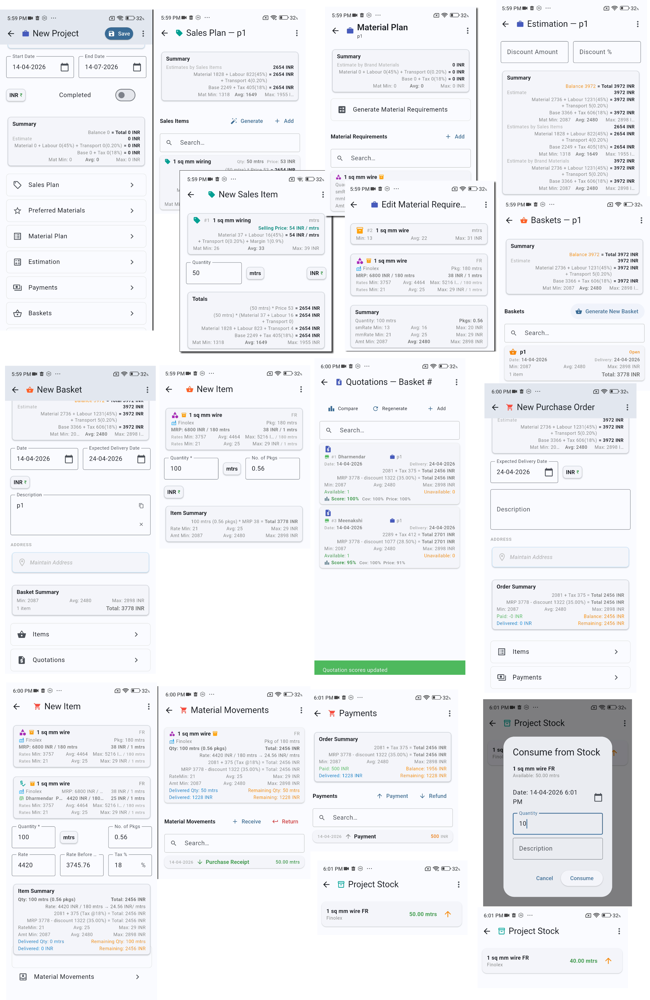

# My Operations

A Flutter-based offline-first operations management system covering the full procurement lifecycle — from vendor and material master data, through project planning and estimation, to purchase orders, goods receipts, and payments — with optional Google Sheets sync.

The app leverages the compute capabilities of mobile devices to give a simple purchase experience. For backup and collaboration it uses Google Sheets as a serverless backend via Google Apps Script — no traditional server infrastructure required.

**Key principle**: Offline-first design means the app works perfectly without internet connectivity, with sync as an optional feature rather than a requirement.

## Features

### Master Data Management
- **Vendors/Suppliers**: Manage vendor information, contacts, capabilities, and addresses
- **Manufacturers**: Track manufacturer data and product availability
- **Materials/Products**: Comprehensive product catalog with specifications and attached documents
- **Manufacturer-Material Mapping**: Track which manufacturers supply which materials
- **Vendor Price Lists**: Dynamic pricing by vendor and material
- **Currencies**: Multi-currency support with conversion
- **Units of Measure**: Flexible unit management (kg, pcs, hrs, etc.)
- **Application Defaults**: Centralized configuration management

### Project Management & Estimation
- **Projects**: Group all procurement and planning activity under a project or cost centre; supports sub-projects
- **Project Locations**: Track multiple sites or delivery locations per project
- **Sales Planning**: Add sales items to a project and derive material requirements from bill of materials
- **Physical Completion Tracking**: Record `quantityCompleted` per sales item; `valueCompleted` and `percentageCompleted` are derived per item and rolled up to the project. Project card and summary display overall completion percentage
- **Material Requirements**: Track required materials per project — automatically derived from the sales plan or entered manually
- **Preferred Materials**: Select preferred vendor/manufacturer material for each requirement
- **Estimation**: Review material requirements with preferred prices to estimate project procurement cost
- **Project Baskets & Purchase Orders**: Create shopping baskets and purchase orders directly linked to a project
- **Project Payments**: Record and track all payments made against a project
- **Payment Schedules**: Auto-generated prorata milestone installments (advance + monthly); tracks percentage, amount, due date, invoice reference, and status lifecycle (PLANNED → DUE → INVOICED → RECEIVED)
- **Expense Tracking**: Real-time purchase expense (Σ PO payments) and labour expense (Σ completed attendance wages) per project; drives profit visibility against totalAmount
- **Project Stock Overview**: View current stock and material consumption per project (goods received vs. requirements)
- **Project Summary**: Consolidated cost, payment, and stock view for a project

### Commitments & Accounting

- **Commitment System**: First-class `commitments` table (polymorphic source pattern) tracks open/partial/closed financial obligations — PO payment commitments, goods-delivery commitments, employee wage commitments, and project revenue commitments (from payment schedules)
- **Commitment Fulfillments**: Partial fulfillment tracking via `commitment_fulfillments`; commitments move OPEN → PARTIAL → CLOSED as payments and goods receipts arrive
- **Chart of Accounts**: 13 seeded double-entry accounts (assets, liabilities, equity, revenue, expenses) — see `AccountCodes`
- **Journal Entries**: Auto-generated double-entry GL entries for goods receipts, vendor payments, project revenue receipts, wage accruals, employee wage payments, and stock consumption write-offs; each domain BO owns the posting for its events; posted entries are immutable (corrections via reversal)

### Employee & Attendance Management
- **Employees**: Manage employee profiles, daily wage rates, and address details
- **Attendance Tracking**: Record daily attendance with duration and wage calculation; calendar view of attendance history
- **Wage Ledger**: Track outstanding wage balances per employee with payment history

### Transaction & Workflow Management
- **Shopping Baskets**: Cart-like system for accumulating purchase items, linkable to a project
- **Request for Quotations (RFQ)**: Generate quote requests to vendors from basket items
- **Quotations**: Manage and compare vendor quotations; promote the winning quotation to a purchase order
- **Purchase Orders**: Create, edit, and track purchase orders with multi-line items; link to project or basket
- **Payments**: Record payments against purchase orders, projects, or employees; track paid amount and outstanding balance
- **Goods Receipts & Material Movements**: Record goods received, returns, project consumption, and global stock write-offs; `direction` (INBOUND/OUTBOUND) derived from movement `type`; tracks delivered vs. ordered quantities per PO line
- **Sales Materials & Bill of Materials**: Manage sales-side product structures
- **Multi-currency Transactions**: Automatic currency handling across all transaction types

### Inventory & Stock
- **Global Stock View**: Cross-project view of all materials received, on order, and available; tracks global stock consumption write-offs (non-project overhead materials)
- **Project Stock**: Per-project view of materials received vs. required, with project consumption tracking
- **Material Movement History**: Full audit trail of goods receipts, returns, and deliveries per purchase order
- **Real-time Quantities**: Stock levels updated immediately on every goods receipt or delivery

### Cloud Synchronization
- **Bidirectional Sync**: Changes sync both to and from Google Sheets
- **Delta Sync**: Only changed data is synchronized (95%+ bandwidth reduction)
- **Conflict Resolution**: Server-wins, client-wins, or merge strategies
- **Pause/Resume**: Users can control and interrupt sync operations
- **Error Recovery**: Automatic retry and partial sync recovery

### Data Management & Developer Tools
- **CSV Import/Export**: Bulk import and export of master data
- **Google Sheets Import/Export**: Pull and push data directly from/to Google Sheets
- **Sample Data Import**: Seed the app with representative data for evaluation
- **Database Browser**: Inspect SQLite schema and data directly
- **Business Object Browser**: Inspect live in-memory BO state for debugging
- **Test Case Recorder & Runner**: Record live sessions as a typed DSL, edit in-app, replay with pass/fail result; supports full arithmetic expressions, builtins (`currentDate()`, `currentDateTime()`), `expectFailure`/`failureMessage`, `realComparisonMargin` for float tolerance
- **Data Consistency Check**: Validate referential integrity across all tables
- **Metadata Browser**: Inspect all `EntityDefinition` and `EntityFieldDefinition` metadata — field types, semantics, formatting rules, and sync flags — per BusinessObject
- **Sync Debug**: Monitor sync operations and the change log
- **Housekeeping**: Archive, clean, or reset application data

## Screenshots

